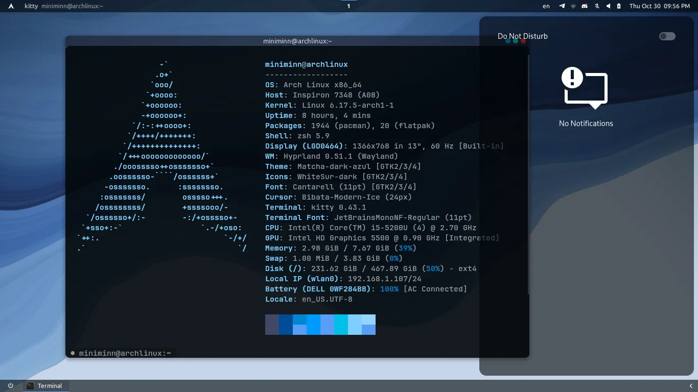
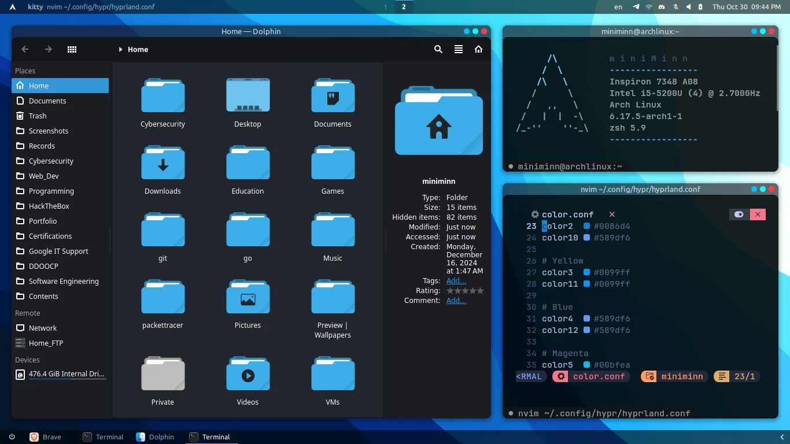
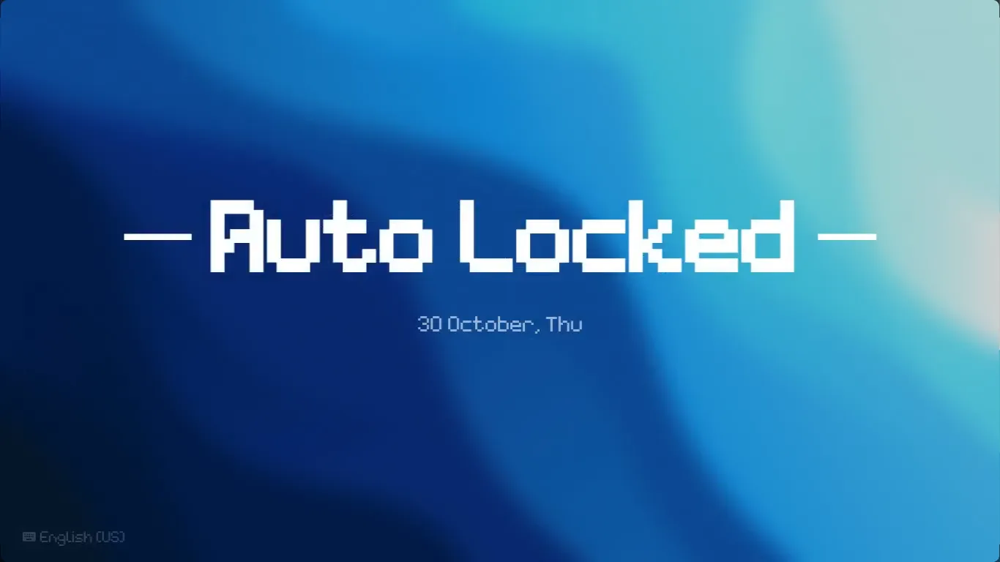

    <h1>miniMinn's Hyprland Dotfiles 🌌</h1>

    
<b>Short Video | Preview</b>

    <video src="https://github.com/user-attachments/assets/4454a490-fae2-4283-bc63-78f6c35c94ee"></video>   

## Desktop

## Theme

## Hyprlock

 

## About My Dotfiles...

Of course, Arch Linux with Hyprland environment has been my primary choice (*3 years*) of Linux daily driving.
I frequently play around with dotfiles to customize the desktop I need: **both balance of ease of use and beautifulness**.
So I created this repo to share my customization dotfiles so you can explore, and also for my backup.

Hope you like my customization! ✨

 

> [!IMPORTANT]  
> These are just personal dotfiles, so the readability might be a littttle confusing for you, but don't worry ;)

 

## Details 📄
**🐧 System**
| Entry | Name |
| - | -- |
| **OS:** | Arch Linux |
| **WM:** | Hyprland |
| **Terminal:** | kitty |
| **Shell:** | zsh |
| **File manager:** | dolphin |
| **GTK/QT Color Theme:** | [Matcha-dark-azul](https://www.gnome-look.org/p/1187179) |
| **GTK Icon Theme:** | [White-Sur](https://www.gnome-look.org/p/1403328), [Tela](https://www.gnome-look.org/p/1279924) |
| **Fonts:** | Ubuntu, JetBrainsMonoNerd Fonts |
| **Keyboard layouts:** | English-US, Burmese-Pyidaungsu |
| **Authentication Agent:** | polkit-kde-agent |
 

